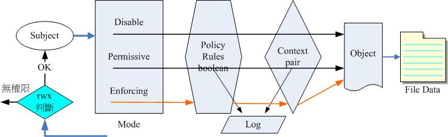

# Linux Development - A first look at SELinux


## 📣 Introduction to SELinux


**The full name of SELinux actually means "Security Enhanced Linux". This guy was first developed by the US National Security Agency. The reason why you want to do this is actually because in early Unix systems, if you set a certain directory After setting it to 777 (drwxrwxrwx), the directory becomes accessible to everyone! For some sensitive internal data, it is likely that due to human setting errors, the data may be stolen or deleted by a third party... The administrator cannot cry even if he wants to!**


### 🎓 Where is SELinux? in inode record

**From the above brief introduction, we roughly know that each network program should have a corresponding SELinux security document, and then after loading it into the memory, its corresponding program SELinux type will be obtained, and whether this program can read a certain file, It also depends on the security text type of the file. So, where are the SELinux types of these security articles and programs recorded? Basically, it is recorded in the i-node of the file! Recall, when you were rescuing the system, if you entered the rd.break rescue environment and left chroot, did you need to "touch /.autorelabel"? Doesn’t this action take a long time? That's why SELinux needs to rebuild the SELinux header data of all files in the system, and needs to re-create the SELinux security document in the i-node of each file! Now you get it!**


```

# 前往 VM 系統，查看一下 /usr/sbin/chronyd 的 SELinux 類型
[root@localhost ~]# stat /usr/sbin/chronyd
  File: /usr/sbin/chronyd
  Size: 353408          Blocks: 696        IO Block: 4096   regular file
Device: fd03h/64771d    Inode: 17318583    Links: 1
Access: (0755/-rwxr-xr-x)  Uid: (    0/    root)   Gid: (    0/    root)
Context: system_u:object_r:chronyd_exec_t:s0
Access: 2023-04-17 07:40:35.000000000 +0800
Modify: 2023-04-17 07:40:35.000000000 +0800
Change: 2023-08-04 13:37:38.809963808 +0800
 Birth: 2023-08-04 13:37:38.806963845 +0800

```


**As shown above, use stat to retrieve the records related to the file name. The most important thing is the Context line. Context is the security article! Therefore, this chronyd executable file, in this article, is "system_u:object_r:chronyd_exec_t:s0" separated by colons (:). There are a total of several fields. The current main restriction is actually only for the third field, which is chronyd_exec_t That’s just the project! Therefore, we know that the security type of this executable file is chronyd_exec_t. In addition to this stat, we can actually see this security article data through ls with -Z:**


```

[root@localhost ~]# ll -Z /usr/sbin/chronyd
-rwxr-xr-x. 1 root root system_u:object_r:chronyd_exec_t:s0 353408 Apr 17 07:40 /usr/sbin/chronyd

```


### 🎓 SELinux operation method and security article


The above is a conceptual operation method. In fact, for the operation of SELinux, you can refer to the following flow chart. After the analysis of traditional DAC, that is, traditional rwx permission access control, if the program can access, it will start to enter the SELinux control process. If the program cannot access it, of course it will not enter the SELinux control process!

In the SELinux control process, when a subject wants to access an object, it must go through the complete SELinux process before it can actually read and write the file data. Therefore, the purpose of MAC is to add to the shortcomings of DAC, not to replace DAC! In fact, you still have to pass the rwx traditional permission control first!


&nbsp; 


**Subject:**
* **Generally speaking, most of the so-called subjects refer to programs, especially Internet programs. Most of the subjects discussed in this chapter are programs.**


**Object:**
* **Whether the main program can access "target resources" means that most targets generally refer to files, but there are exceptions! For example, the subject may want to enable a network port, in which case the target becomes the port resource! However, most of them refer to files.**


**SELinux mode (Mode):**
* **SELinux has three modes depending on whether it is enabled or not, namely Disabled, Permissive and Enforcing. According to the arrows in the picture above, you can know that in disabled and permissive modes, SELinux does not actually control program access! Only the enforcing mode will actually manage each project!**


**Policy, rules, boolean:**
* **Due to the large number of subject programs and target files, SELinux will develop basic access security policies based on certain services. These policies will also have detailed rules (rules) to specify whether different services open access to certain resources. In addition, whether certain functions are allowed (SELinux boolean) also needs to be controlled and understood. In the current RockyLinux 9, there are mainly 3 policies provided, and the default is the targeted policy. For relevant policy descriptions, please refer to the contents of /etc/selinux/config:**


**Security context:**

* **The security text that each subject program can access is different. SELinux will standardize the security text types that the subject program can access. When the security text of the target file is a type that the subject program can access, the subject program can proceed. Access to the target file. This security context is a bit like the concept of SELinux's rwx! If the security context of the object to be accessed by the subject does not match, then in enforcing mode, a permission incompatibility error message will appear for this access! At this point, no matter how open your permission settings are, the program cannot read the file!**


#### Security article

**Again, the record of the security document is mainly in the inode of the file. The program will also have the record of the security document. Let us recall again, how to obtain the information of the security document?**


```

# 程序的安全本文取得
[root@localhost ~]# ps -auxZ | egrep 'bash|chronyd|LABEL'
LABEL                                                 USER   ...  COMMAND
system_u:system_r:chronyd_t:s0                        chrony ...  /usr/sbin/chronyd -F 2
unconfined_u:unconfined_r:unconfined_t:s0-s0:c0.c1023 root   ...  -bash

# 檔案的安全本文觀察
[root@localhost ~]# ll -Z /usr/sbin/chronyd /etc/chrony.keys
-rw-r-----. 1 root chrony system_u:object_r:chronyd_keys_t:s0    540 Aug 29  2022 /etc/chrony.keys
-rwxr-xr-x. 1 root root   system_u:object_r:chronyd_exec_t:s0 353408 Apr 17 07:40 /usr/sbin/chronyd

[root@localhost ~]# ll -Zd /root/anaconda-ks.cfg /home/vbird
drwx------. 2 vbird vbird unconfined_u:object_r:user_home_dir_t:s0  113 Aug  4 13:43 /home/vbird
-rw-------. 1 root  root  system_u:object_r:admin_home_t:s0        1204 Aug  4 13:05 /root/anaconda-ks.cfg

```


**Mostly just remember the first three fields! The functions of these three fields are:**

```

User_Identify:role:type
SELinux用戶別:角色:類型

```


**SELinux User Identify: It is equivalent to the identity of the account. Because it is mainly related to the SELinux user category, it always ends with _u. Can be roughly divided into two types:**

* **system_u: Represents the identification of system programs. Most of them refer to situations where there are management restrictions.**

* **unconfined_u: Indicates no restrictions**


**Role: Through the role field, we can know whether this data belongs to a program, a file resource, or represents a user. Common roles include:**

* **object_r: represents file resources such as files or directories, which should be the most common;**

* **system_r: represents a program with administrative restrictions!**

* **unconfined_r: indicates no restrictions**


**Type: In the default targeted policy, the User Identify and Role fields are basically unimportant! What's important is the type field! Basically, whether a main program can read this file resource depends on the type field! The definitions of the type field in files and programs are different, they are:**

* **type: called type (Type) on file resources (Object);**

* **Domain: In the subject program (Subject), it is called domain!**


### 🎓 Three modes of SELinux

* **Disabled: In fact, it means turning off SELinux. In this mode, all SELinux security documents recorded by all inodes in the file system will disappear! It means there is no SELinux! So, don’t just jump into this mode!**

* **Permissive: Permissive mode. According to the diagram, we also know that the permissive mode does not actually control the subject and target! So what’s wrong with this mode? Look carefully at the icon, you will find that the tolerance mode has an extra arrow above the log! Most of the log files are recorded in /var/log/messages! This permissive mode is often used in debugging! When the subject cannot obtain the target, you can change the mode to permissive, and after reproducing the error, you can go to the log to see if there is a solution!**

* **Enforcing: Enforcing mode, the subject will begin to be managed by SELinux policies, rules, functional conditions, and security article comparison analysis. If a match is achieved, the subject can be prepared to access the target resource.**


#### Observation and conversion of SELinux mode

**Permissive mode and forced mode can be converted directly without restarting! Therefore, if you want to determine whether a subject cannot access the target due to SELinux or traditional permissions, you can temporarily switch the SELinux mode to the permissive mode for testing. So how to observe the current SELinux mode? Just use getenforce.**


```

# 觀察目前的 SELinux 模式
[root@localhost ~]# getenforce
Enforcing

# 暫時將 SElinux 模式調整成為 permissive
[root@localhost ~]# setenforce [0|1]
[root@localhost ~]# setenforce 0
[root@localhost ~]# getenforce
Permissive

# 顯示詳細的 SELinux 設定值
[root@localhost ~]# sestatus
SELinux status:                 enabled
SELinuxfs mount:                /sys/fs/selinux
SELinux root directory:         /etc/selinux
Loaded policy name:             targeted
Current mode:                   permissive
Mode from config file:          enforcing
Policy MLS status:              enabled
Policy deny_unknown status:     allowed
Memory protection checking:     actual (secure)
Max kernel policy version:      33

# 趕緊將模式轉回 Enforcing
[root@localhost ~]# setenforce 1

```


#### How to set up SELinux mode


**The default SELinux configuration file is /etc/selinux/config, but we can also force SELinux on or off in the Linux kernel during the boot stage. Therefore, to observe the initial settings of SELinux, you may have to observe two places! They are the above configuration files and grub settings. Of course, you can also directly observe the current core parameters to confirm whether SELinux is affected by the core parameters.**


```

# 修改預設的設定檔，指定開機為 SELinux 模式
[root@localhost ~]# vim /etc/selinux/config
SELINUX=enforcing
SELINUXTYPE=targeted
# 其實，這個設定檔就是指定 SELinux 模式與政策的檔案

# 檢查目前的核心是否有 SELinux 的參數
[root@localhost ~]# cat /proc/cmdline
BOOT_IMAGE=(hd0,gpt3)/boot/vmlinuz-5.14.0-284.18.1.el9_2.x86_64 root=UUID=e81ba...
# 查詢看看有沒有 selinux=[0|1] 這個關鍵字串！

# 檢查 grub.cfg 有沒有 selinux 的關鍵字
[root@localhost ~]# grep selinux /boot/grub2/grub.cfg

```


### 🎓 Observation and modification of SELinux boolean


**In the second step of entering the entire SELinux process, in addition to referring to the rules in the policy, it is also very important whether certain specific functions (SELinux boolean) are enabled! For example, see if the web server can provide read access to the home directory of a general account, which is additionally specified through the specifications here. If the functional specifications here do not allow the web server to read the personal home directory, then even if the security article type of the personal home directory is correct, the web server will not be able to read it!**


#### Use getsebool and semanage boolean to query each rule


**To query whether the current status of all SELinux boolean functions is on or off, the easiest way is to query it through getsebool:**


```

[root@localhost ~]# getsebool -a
abrt_anon_write --> off
abrt_handle_event --> off
.....
zoneminder_anon_write --> off
zoneminder_run_sudo --> off
# 功能規範真的太多了！透過 grep 來擷取看看

# 查詢看看有沒有 http 開頭，home 後續存在的功能規範
[root@localhost ~]# getsebool -a | grep 'http.*home'
httpd_enable_homedirs --> off

# 已經知道 httpd_enable_homedirs 功能規範名稱時
[root@localhost ~]# getsebool httpd_enable_homedirs
httpd_enable_homedirs --> off

```


**In addition to getsebool, we can use the universal tool, the semanage software, to query the boolean command in it!**


```

# 需要先安裝 semanage 的軟體！名稱為 policycoreutils-pythone-utils
[root@localhost ~]# yum whatprovides '*bin/semanage'
policycoreutils-python-utils-3.5-1.el9.noarch : SELinux policy core python utilities
Repo        : appstream
Matched from:
Other       : *bin/semanage

[root@localhost ~]# yum -y install policycoreutils-python-utils

# semanage boolean 的簡單 help
[root@localhost ~]# semanage boolean -h
....
  -l, --list            List records of the boolean object type
  -1, --on              Enable the boolean
  -0, --off             Disable the boolean

[root@localhost ~]# semanage boolean --list
SELinux boolean                State  Default Description
....
httpd_enable_homedirs          (off  ,  off)  Allow httpd to enable homedirs
....

```


### 🎓 Modification of SELinux security article

**We talked about the SELinux security article earlier. On the program, the commands that can be viewed are "ps -Z" and other methods. The security article of the file can be viewed through the "ll -Z" or "stat" command. Inquire. What about modifications? How to modify this security article? Note, when modifying, please modify the type of security article and do not change the identity or role field!**


#### Use chcon to modify the security text type

**The simplest way to modify it is to modify it through chcon! For example, the following example:**


```

[root@localhost ~]# chcon [OPTION]... [-t TYPE] FILE...
[root@localhost ~]# chcon [OPTION]... --reference=RFILE FILE...
選項與參數：
-t  ：後面接安全性本文的類型欄位！例如 httpd_sys_content_t
--reference=RFILE：拿檔名為 RFILE 當範例來修改後續接的檔案的類型！

# 將 /etc/hosts 複製 /dev/shm/hosts，並修改類型為 etc_t
[root@localhost ~]# cd /dev/shm
[root@localhost shm]# cp -a /etc/hosts .
[root@localhost shm]# ll -Z hosts
-rw-r--r--. 1 root root system_u:object_r:net_conf_t:s0 158 Jun 23  2020 hosts

[root@localhost shm]# chcon -t etc_t hosts
[root@localhost shm]# ll -Z hosts
-rw-r--r--. 1 root root system_u:object_r:etc_t:s0 158 Jun 23  2020 hosts

# 將類型改成與 /var/spool/mail 相同
[root@localhost shm]# ll -Zd /var/spool/mail/
drwxrwxr-x. 2 root mail system_u:object_r:mail_spool_t:s0 19 Jul 21 15:01 /var/spool/mail/

[root@localhost shm]# chcon --reference=/var/spool/mail hosts
[root@localhost shm]# ll -Z hosts
-rw-r--r--. 1 root root system_u:object_r:mail_spool_t:s0 158 Jun 23  2020 hosts

```


#### Use semanage fcontext to query the default type of directory/file

**I wonder if you are curious, since the SELinux mode can be switched between disable and enforcing, but when switching to enforcing, it may take a while for the core to relabel the files in the entire system! This means that each file/directory may have a default value! So how to query the default value? Go through semanage! Try this:**


```

# 找到 /etc/sysconfig 相關的預設 SELinux 安全本文類型
[root@localhost ~]# semanage fcontext --list | grep /etc/sysconfig
SELinux fcontext              type           Context
/etc/sysconfig/.*l2tpd        regular file   system_u:object_r:l2tp_conf_t:s0
/etc/sysconfig/MailScanner    regular file   system_u:object_r:mscan_etc_t:s0
.....

```


**It is very easy to view the default SELinux security document type for a certain file/directory. good! So if it's not in the regular directory, what is the default safe article type? Basically, just look at the first few lines of output of the above information and you will know!**


```

[root@localhost ~]# semanage fcontext --list | head
SELinux fcontext   type          Context
/                  directory     system_u:object_r:root_t:s0
/.*                all files     system_u:object_r:default_t:s0
/[^/]+             regular file  system_u:object_r:etc_runtime_t:s0
.....

```


#### Use semanage fcontext to modify/set the default value of a directory


**Suppose we plan to create a directory named /www. The contents of this directory are mainly used by the web server! Therefore, the primary SELinux type should be specified as the same directory as /var/www. So how to deal with it? Basically, you can do it like this.**


```

# 基本的設定語法，如下所示，只要改 type 與目錄位置即可
[root@localhost ~]# semanage fcontext -a -t type "/some/dir(/.*)?"

# 1. 先找到 /var/www 的類型為何
[root@localhost ~]# semanage fcontext -l | grep '/var/www('
/var/www(/.*)?              all files   system_u:object_r:httpd_sys_content_t:s0
/var/www(/.*)?/logs(/.*)?   all files   system_u:object_r:httpd_log_t:s0

# 2. 建立所需目錄，並且查看預設值
[root@localhost ~]# mkdir /www
[root@localhost ~]# echo check > /www/index.html
[root@localhost ~]# ll -Zd /www /www/index.html
drwxr-xr-x. 2 root root unconfined_u:object_r:default_t:s0 24 Jul 22 14:40 /www
-rw-r--r--. 1 root root unconfined_u:object_r:default_t:s0  6 Jul 22 14:40 /www/index.html
# 果然預設值是 default_t 呢！

# 3. 增加 /www 預設為 httpd_sys_content_t 的類型
[root@localhost ~]# semanage fcontext -a -t httpd_sys_content_t "/www(/.*)?"
[root@localhost ~]# semanage fcontext -l | grep '^/www'
/www(/.*)?    all files     system_u:object_r:httpd_sys_content_t:s0

```


#### Use restorecon to restore default values

Now that we have planned the default type of /www, do we still need to use chcon to slowly adjust the SELinux specifications one by one? It seems that it is not needed! Just restore it directly through restorecon! Very relaxing and happy!

```

# 將剛剛的 /www 安全本文類型重置一下！
[root@localhost ~]# restorecon -Rv /www
Relabeled /www from unconfined_u:object_r:default_t:s0 
  to unconfined_u:object_r:httpd_sys_content_t:s0
Relabeled /www/index.html from unconfined_u:object_r:default_t:s0 
  to unconfined_u:object_r:httpd_sys_content_t:s0

```

After adding -v, even the modification process will be told to you! Very simple and enjoyable! If in a special case you want to restore the SELinux type of the entire system, you can do it directly by using restorecon without entering the core function!


```

[root@localhost ~]# restorecon -Rv /

```


